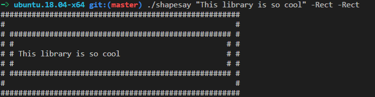
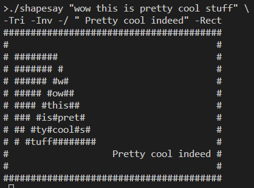
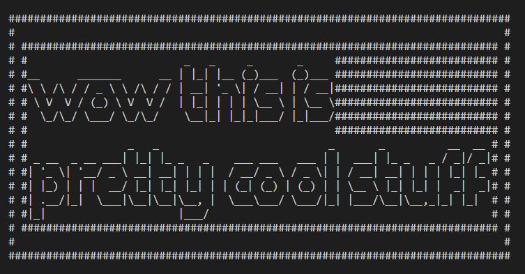
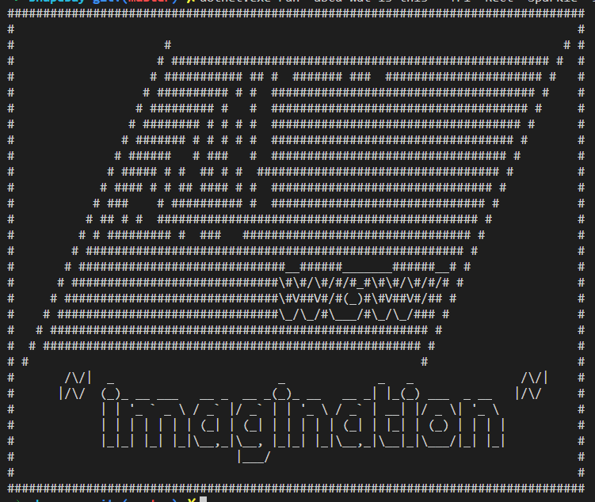
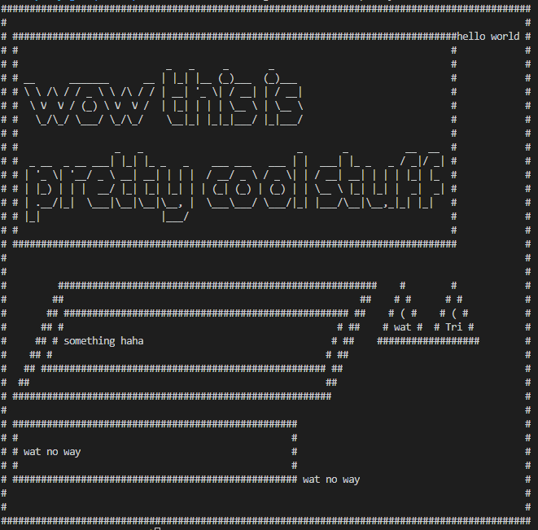

# shapesay
Wrap text in cool shapes, like cowsay! Cross-platform on .Net Core



## Soptisticated options

Rectangles with -Rect

Triangles with -Tri

Slanted parallelograms with -Ital

Invert shape content with -Inv

Invert random shape content with -InvRand

Replace content with "sparkles" with -Spark

Pad lines with spaces on the right side to match the longest line with -Pad

Add text anywhere in between shapes.

Back-track to previous shape line with -/

Append expressions horizontally with `EXPR_R + EXPRL`

Group expressions with `"(" EXPR ")"`

### Examples:

Abstract art

```sh
shapesay "wow this is pretty cool stuff" -Tri -Inv -/ " Pretty cool indeed" -Rect
```



Combined with *nix package figlet.

```sh
shapesay "`figlet wow this is pretty cool stuff`" -Inv  -Rect -Inv -Rect
```



Going crazy

```sh
shapesay "abcd wat is this" -Tri -Rect -Sparkle -Ital "`figlet -c wow`" -Rect -Inv -Ital "`figlet -c '~ imagination ~'`" -Rect
```



Oh no, is this too far?? 😄

```sh
shapesay "`figlet wow this is pretty cool stuff`" -Rect + "hello world" -Pad "(" "something haha" -Rect -Rect -Ital -Pad "(" "wat no way" -Rect -/ " wat no way" ")" + "(" "wat" -Tri ")" -Pad + "(" "Tri" -Tri ")" ")" -Rect
```


